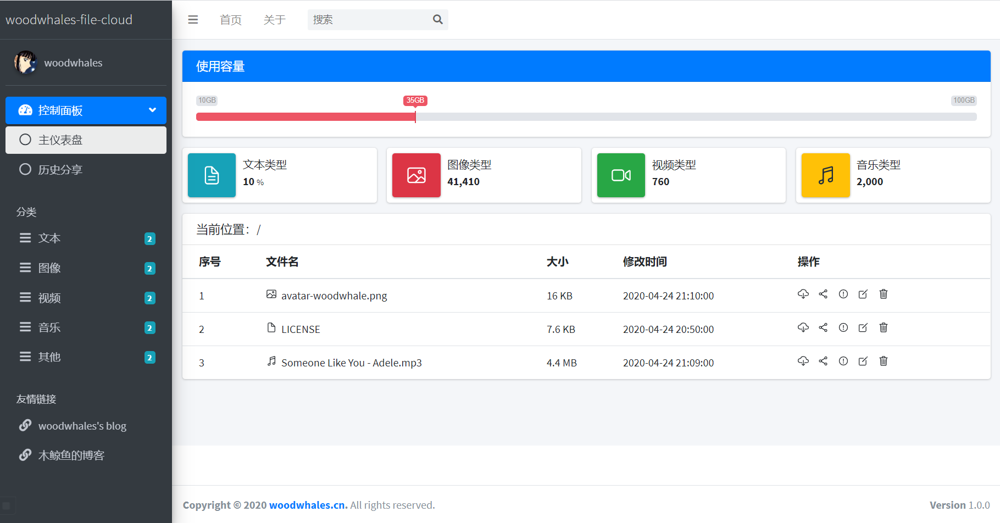

# woodwhales-file-cloud

[](https://woodwhales.cn/) 

独立开源个人网盘

> 作者：[woodwhale's blog](https://woodwhales.cn/)

技术支持：Spring Boot + Thymeleaf + AdminLTE



## 环境要求

环境要求：JDK 1.8 +

本系统使用 maven 代码版本管理，请自行安装配置 maven 环境。

浏览器建议使用 chrome、firefox、edge。

> 实测三者浏览器新版均可兼容

## 搭建教程

### ftp 服务搭建

说明：本项目依赖 ftp 服务器，因此必须搭建 ftp 服务，windows 环境搭建教程，参见：[windows 搭建 FTP 服务器](https://woodwhales.cn/2020/04/21/067/)，搭建成功之后，需要更改 application.yml 配置文件中的 ftp 服务链接配置。

### 下载源码

下载源码，克隆 git 代码：

```shell
git clone https://github.com/woodwhales/woodwhales-file-cloud.git
```

### 编译打包

进入项目根目目录，执行 mvn 命令打包工程：

```shell
mvn clean install
```

### 运行项目

进入 target 文件目录，执行如下命令启动项目：

```shell
java -jar woodwhales-file-cloud.jar
```

项目启动成功，默认开启 12306 端口，可在 `src\main\resources\application.yml` 配置文件中修改启动端口。浏览器访问：http://127.0.0.1:12306/file-cloud/

## 功能迭代

### 1.0.0_2020-04-24

UI交互：

1. 可展示用户头像、预览功能；
2. 可展示文件列表，可点击进入文件夹，可返回上级目录，可点击下载按钮下载文件。 

后台功能：可列表展示、更新、上传文件，对文件类型进行分类。

### 1.0.1_2020-04-24

UI交互：

1. 操作图标间距统一；
2. 系统版本从 pom 文件中动态读取

后台功能：封装 gson 工具中对象转json字符串方法

### 1.0.2_2020-04-26

UI 交互：增加分享、删除、文件详情交互

后台功能：增加分享、删除、文件详情查看接口